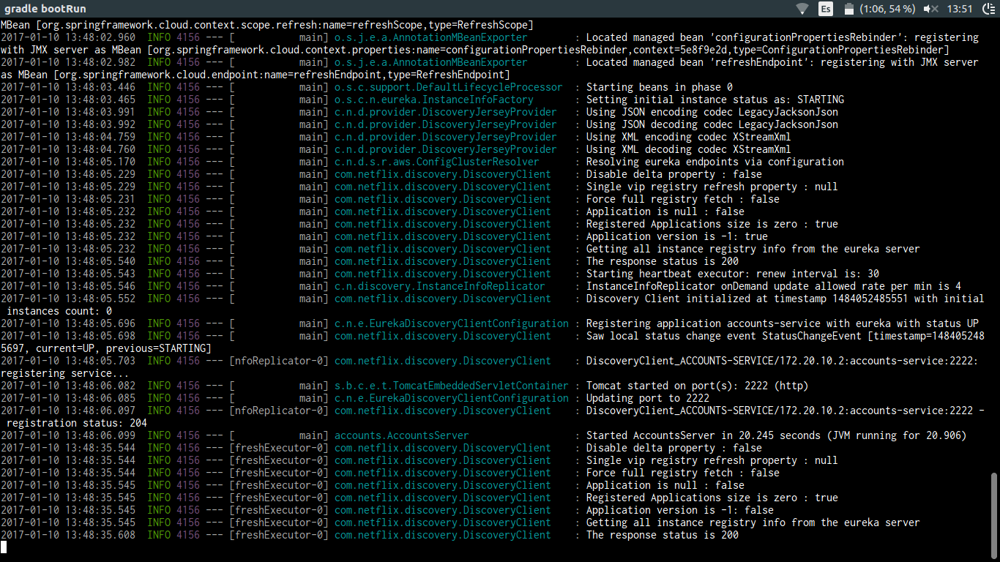
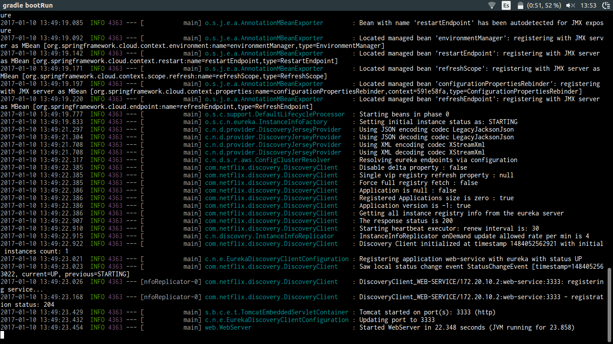
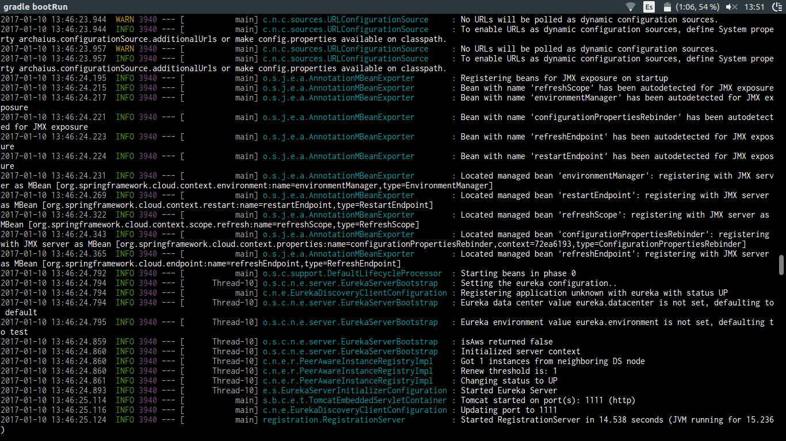
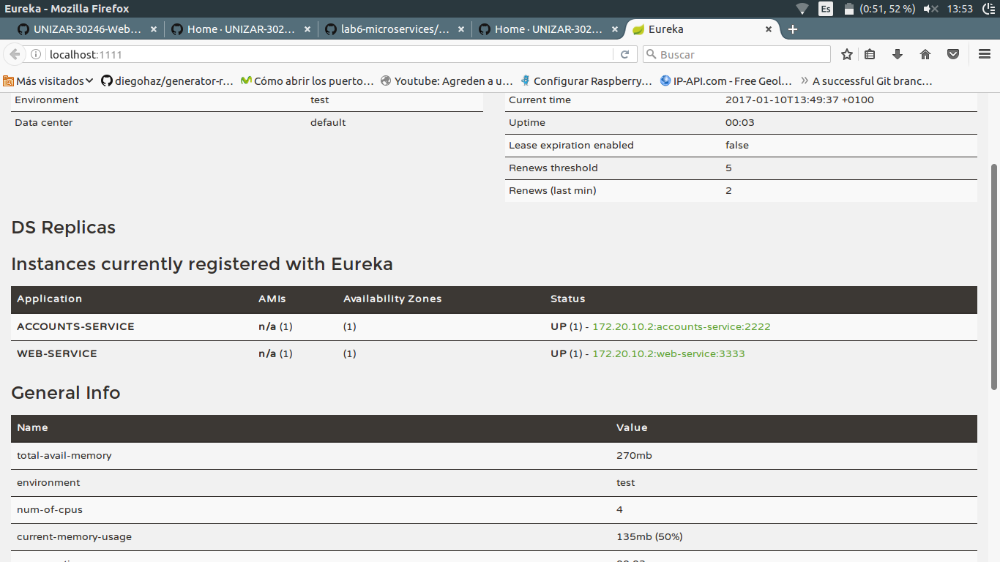
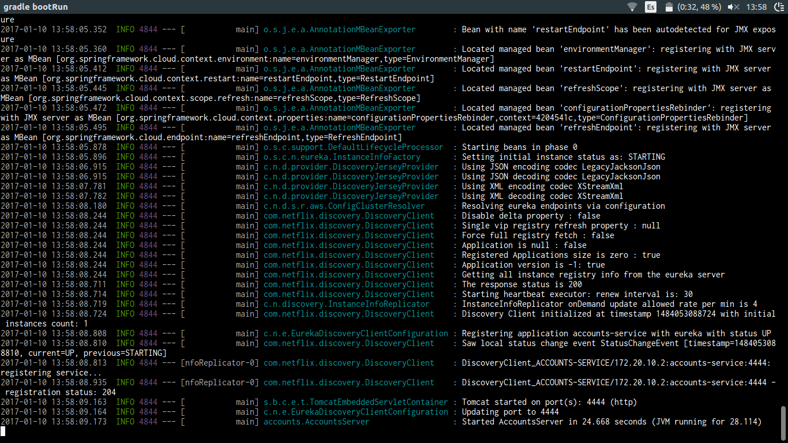

The two microservices are running and registered (two terminals, logs screenshots).

The service registration service has the two microservices registered (a third terminal, dashboard screenshots)

A second account microservice is running in the port 4444 and it is registered (a fourth terminal, log screenshots).

A brief report describing what happens when you kill the microservice with port
2222. Can the web service provide information about the accounts? Why?

When the account server (port 2222) is deleted and the web server (port 3333) attempts to provide server account information, it returns a connection refused message. When the web server tries to connect again, it gets the correct account server on port 4444 and can return the information.